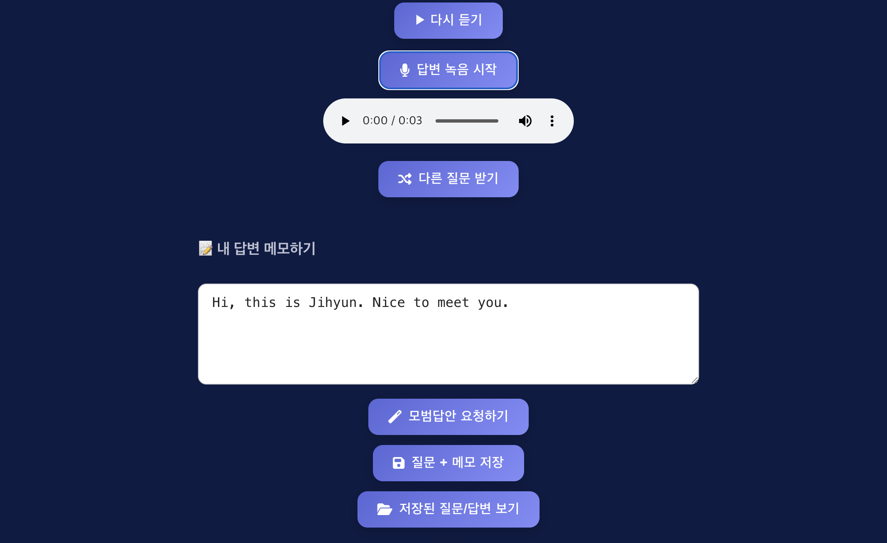
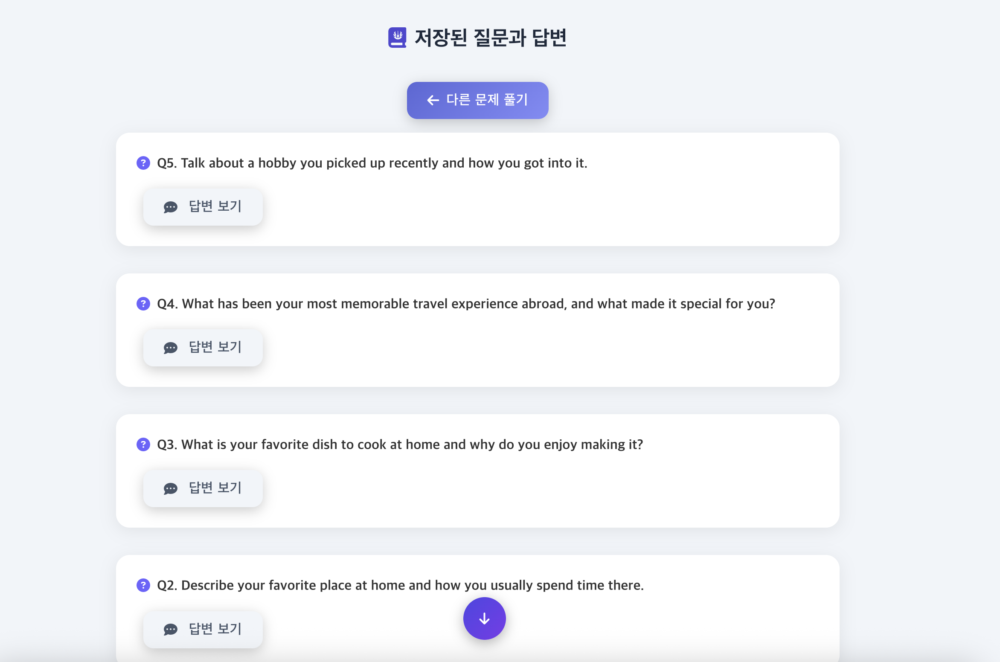

# 🎤 OPIC AI Trainer

AI를 활용해 OPIC(Oral Proficiency Interview) 시험 대비를 도와주는 웹 애플리케이션입니다.
실제 시험과 유사한 환경에서 아바타가 음성으로 질문을 제시하고, 사용자는 음성 또는 텍스트로 답변할 수 있습니다.
또한, 실제 시험처럼 OPIC Survey 단계를 거친 뒤, 그 결과를 기반으로 맞춤형 질문이 제공됩니다.

---

## 🚀 배포 링크
🔗 [OPIC AI Trainer 바로가기](https://illustrious-hummingbird-0af3bb.netlify.app/)

---

## 📌 주요 기능
- **OPIC Survey** – 실제 시험과 유사한 Survey 진행 후, Survey 결과 기반 질문 제공  
- **아바타 질문 시스템** – OpenAI TTS API를 활용해 아바타가 음성으로 질문 제시  
- **음성 녹음 및 재생** – 브라우저에서 직접 답변 녹음 및 재생 가능  
- **모바일 최적화** – 모바일 환경에서는 음질 문제를 보완하기 위해 텍스트 답변 모드로 전환  
- **답변 메모 & 저장** – 말한 내용을 메모하고, 브라우저 `localStorage`에 저장하여 재확인 가능  
- **모범 답안 보기** – OpenAI API 기반 예시 답변 제공  

---

## 🖼 화면 미리보기

### 메인 화면


### OPIC Survey 화면


### 문제 화면


### 녹음 화면


### 모바일 


### 답변 저장 화면



---

## 🛠 기술 스택
### Frontend
- React.js
- CSS
- Web Audio API (음성 녹음)
- localStorage (간단한 답변 저장)

### Backend
- Node.js (Express)
- OpenAI API (질문 생성 & 모범 답안 생성)
- OpenAI API (TTS: 음성 합성, STT: 음성 → 텍스트 변환)

### 배포
- Frontend: Netlify
- Backend: Render

---

## 📂 프로젝트 구조

```bash
OPIC-AI-TRAINER/
├─ backend/
│  ├─ node_modules/
│  ├─ .env                  # 환경 변수 (API 키 등)
│  ├─ .gitignore
│  ├─ index.js
│  ├─ server.js             # Express 서버 (OpenAI API 연동)
│  ├─ package.json
│  └─ package-lock.json
│
├─ build/                   # 프론트엔드 빌드 결과
│  ├─ static/
│  ├─ asset-manifest.json
│  ├─ favicon.ico
│  ├─ index.html
│  ├─ manifest.json
│  └─ robots.txt
│
├─ frontend/
│  ├─ assets/               # README 캡처 이미지
│  │  ├─ main.png
│  │  ├─ opic survey.jpg
│  │  ├─ question.jpg
│  │  ├─ answer1.png
│  │  ├─ answer2.png
│  │  ├─ mobile.jpeg
│  │  └─ record.jpg
│  │
│  ├─ public/
│  │  ├─ _redirects
│  │  ├─ avatar.png
│  │  ├─ favicon.ico
│  │  ├─ index.html
│  │  ├─ manifest.json
│  │  └─ robots.txt
│  │
│  ├─ src/
│  │  ├─ api.js             # API 요청 유틸
│  │  ├─ App.js             # 메인 App 컴포넌트
│  │  ├─ App.css
│  │  ├─ App.test.js
│  │  ├─ index.js
│  │  ├─ index.css
│  │  ├─ logo.svg
│  │  ├─ reportWebVitals.js
│  │  └─ setupTests.js
│  │
│  ├─ .env
│  ├─ .gitignore
│  ├─ package.json
│  └─ package-lock.json
│
└─ README.md

## 💡 향후 개선 계획
- **MongoDB 연동**하여 서버 기반 답변 저장 기능 구현  
- **사용자 계정 시스템** 추가로 개인별 연습 기록 관리  
- **통계/피드백 시스템** 도입하여 학습 성과 시각화  
- **D-ID API 활용**으로 아바타의 입모양을 실제 음성과 동기화하여 몰입감 있는 연습 환경 제공  

---

## 📜 라이선스
MIT License